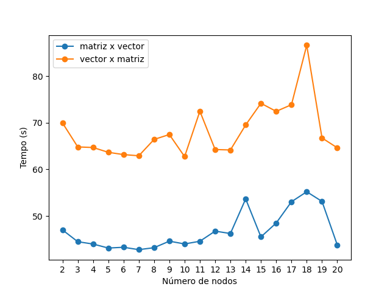
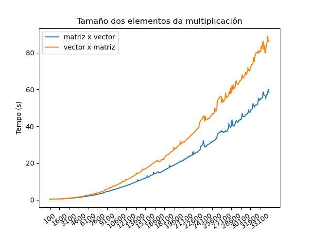

\newpage
\pagenumbering{arabic}

<!--
TODO: poñer o dos datos derivados
-->

# Descrición do problema

Nesta práctica búscase realizar a multiplicación dunha matriz por un vector de forma paralela mediante o uso de MPI. Ó non ler correctamente o enunciado proposto, durante o desenvolvemento do código supúxose que a matriz non tiña por que ser cadrada. A maiores implementouse a posibilidade de non só multiplicar unha matriz por un vector senón tamén multiplicar un vector por unha matriz.

Igual que se implementaron cousas a maiores, tamén outras quedaron sen facelo, máis concretamente a distribución por bloques de columnas. O código distribúe a matriz por bloques de filas, ó resultaren máis sinxelas de partillar. Este erro non se arranxou por falta de tempo, xa que o código estaba nun estado final cando se supo deste requerimento.

Como xa indicamos previamente, o código permite tanto a multiplicación dunha matriz de dimensións $m \times n$ por un vector de lonxitude $n$ como a multipliicación dun vector de lonxitude $m$ por unha matriz de dimensións $m \times n$. Ó principio isto implementouse lendo os elementos de cada dato a través de ficheiros de texto, pero non se conseguiu que funcionase ó executalo no CESGA, polo que na versión final só se indican as dimensións de cada un dos datos e a dirección da multiplicación.

A execución dos procesos MPI está implementada seguindo un esquema mestre-esclavo, polo que o número mínimo de nodos precisos para executar o programa é de dous, sendo 0 quen se ocupa da xeración da matriz e do vector e 1 quen realiza a súa multiplicación. Isto explicarémolo en máis detalle na seguinte sección.

<!--
O código desenvolto nesta práctica busca realizar a multiplicación dunha matriz por un vector. Debido a non ler correctamente o enunciado, entendeuse que a matriz non tiña por que ser cadrada, e ademais a distribución foi por bloques de filas, e por falta de tempo non se arranxou este erro, ó ter o código nun estado final.

Por tanto, o código implementa cousas que non tiña que implementar e non implementa outras que si que tiña que facer, así que antes da explicación do código pararémonos un pouco a explicar que exactamente é o que fai.

O código permite tanto a multiplicación dunha matriz de dimensións mxn por un vector de dimensión n como a multiplicación dun vector de dimensión m por unha matriz de dimensión mxn. Está o código implementado para a lectura destes dous datos dende dos ficheiros de texto, pero non se conseguiu que funcionase ó executalo no CESGA, polo que o que se indica ó executar o programa é a dirección da multiplicación (vector x matriz ou matriz x vector) e as dimensións tanto da matriz como do vector.

A execución dos procesos con MPI está implementada seguindo un esquema mestre-esclavo, polo que o número mínimo de nodos precisos para executar o programa é de dous, sendo o 0 o que se ocupa da xeración da matriz e o 1 o que realiza a multiplicación. Isto explicarémolo en máis detalle na seguinte sección.
-->

# Explicación do código

Podemos dividir o código desenvolvido en 4 seccións diferentes. Por unha banda, toda a parte da inicialización, tanto dos parámetros MPI como da matriz e o vector para tódolos nodos. Despois está a multiplicación dos dous elementos, a recolección dos resultados e, por último, a parte final onde imprimimos as medicións obtidas e rematamos os procesos MPI.

<!--
O código podemos dividilo en varias seccións diferenciadas. Por unha banda, toda a parte de inicialización, tanto dos parámetros MPI como da matriz e o vector para tódolos nodos. Despois, está a multiplicación dos dous elementos, a recolección de resultados e, por último, a parte final imprimindo as medicións obtidas e rematando os procesos MPI.
-->

## Inicialización

O programa recibe 4 argumentos por liña de comandos, sendo estes a dirección da operación, as dúas dimensións da matriz e a dimensión do vector, nesta orde. Polo tanto, previa inicialización de MPI, faremos unha comprobación e, se as dimensións non coinciden, avisamos e paramos a execución.

Se os argumentos pasados son correctos, iniciamos MPI e comprobamos o número de nodos totais. Se, como comentamos anteriormente, este é inferior a 2 ou é maior ó número de filas ou columnas (dependendo da dirección da multiplicación) da matriz, tamén avisamos ó usuario e deixamos de executar.

Unha vez realizadas todas estas comprobacións é cando no nodo 0 xeramos tanto a matriz coma o vector, co seguinte código (acortado):

<!--
Como comentamos anteriormente o programa recibe 4 argumentos diferentes, que son a dirección, as dúas dimensións da matriz e a do vector, nesa orde. Polo tanto, previa inicialización de MPI, facemos unha comprobación, se as dimensións non coinciden, avisamos e paramos a execución.

No caso en que coincidan, iniciamos MPI e comprobamos o número de nodos dispoñibles. Se, como dixemos anteriormente, este é inferior a 2, tamén paramos a execución. Tamén comprobamos se o número de nodos é inferior ás filas/columnas da matriz (dependendo da dirección da multiplicación), e tamén deixamos de executar se é o caso.

Unha vez realizadas todas estas comprobacións é cando no nodo 0 xeramos a matriz e o vector, co seguinte (acortado) código:
-->

```c
mat = _gen_matrix(mat_m, mat_n);
if (dir) mat = _transpose(mat, &mat_m, &mat_n);
vec = _gen_vector(vec_l);
```

Neste extracto amósase unha particularidade do código, Para poder partillar a matriz de forma sinxela na multiplicación no caso de ser esta dun vector por unha matriz, realízase a transposta desta, multiplicando matriz por vector e puidendo así pasar cada fila nunha chamada ás funcións do MPI, ó estaren os elementos dela contiguos en memoria.

Isto presenta un problema, que é que durante a chamada a `_tranpose()` a memoria usada case se duplica, xa que conviven durante un pequeno rato as dúas matrices xuntas, ademais de incurrir nun gran gasto temporal.

Idealmente, se tanto a matriz como o vector fosen lidos dende ficheiros, como estaba planeado, leríase a matriz por columnas en vez de por filas, evitando así en parte o custo temporal e totalmente o custo espacial que implica transpoñela.

En canto á inicialización das variables no resto dos nodos, os datos relevantes partíllanse dende o nodo mestre usando varias chamadas a `MPI_Broadcast()`, como podemos ver a continuación nun código moi simplificado:

<!--
Aquí móstrase unha particularidade do código. Para poder partillas a matriz de forma sinxela na multiplicación do vector por matriz, realízase a transposta desta para así multiplicar matriz por vector e poder pasar cada fila nunha chamada ás funcións do MPI, ó estaren os elementos dela contiguos en memoria.

Isto ten un problema, que é que ó chamar a `_transpose()` a memoria usada case se duplica, xa que conviven durante un pequeno rato as dúas matrices xuntas.

Idealmente, se tanto matriz como vector fosen lidos dende ficheiros, como estaba planeado, leríase a matriz por columnas en vez de por filas, evitando así o custo temporal e especial que implica transpoñela.

En canto á inicialización das variables no resto de nodos, partíllase con varios `MPI_Broadcast()` a información necesaria dende o nodo mestre, como veremos a continuación, nun código moi simplificado:
-->

```c
MPI_Bcast(&vec_l, 1, MPI_LONG, 0, MPI_COMM_WORLD);

/* vector malloc for nodes different than 0 */

MPI_Bcast(vec, vec_l, MPI_DOUBLE, 0, MPI_COMM_WORLD);
MPI_Bcast(&mat_m, 1, MPI_LONG, 0, MPI_COMM_WORLD);
MPI_Bcast(&n_rows, 1, MPI_LONG, 0, MPI_COMM_WORLD);

if (!node) {
    // waits until node 1 finishes allocating, then starts sending data
    MPI_Recv(&flag, 1, MPI_SHORT, 1, MPI_ANY_TAG, MPI_COMM_WORLD, NULL);
    long col = 0;
    for (int dest = 1; dest < npes; dest++) {
        for (int i = 0; i < n_rows; i++) {
            col = (dest - 1) * n_rows + i;
            MPI_Send(mat[col], mat_n, MPI_DOUBLE, dest, dest, MPI_COMM_WORLD);
        }
    }
} else {
    mat_m = n_rows;

    /* matrix malloc */

    if (node == 1) {
        MPI_Send(&flag, 1, MPI_SHORT, 0, 1, MPI_COMM_WORLD);
    }

    for (long i = 0; i < mat_m; i++) {
        MPI_Recv(mat[i], mat_n, MPI_DOUBLE, 0, node, MPI_COMM_WORLD, NULL);
    }
}
```
Pódese dividir o extracto superior en dúas partes distintas. A primeira, os 4 *broadcasts* feitos dende o nodo 0 para partillar toda a información común (`n_rows` é o número de filas que van ter as matrices dos nodos traballadores, e está calculado como a división enteira entre o número de filas total e o número de nodos menos 1), isto é, lonxitude do vector, vector en si e dimensións da matriz.

Por outra banda, temos a comunicación entre nodos. Ó seren as filas da matriz diferentes para cada nodo, e non coñecer no momento da realización deste código a posibilidade dos datos derivados en MPI, fixéronse *sends* e *receives* para este paso, o que máis tarde derivou nunha execución moi custosa temporalmente.

<!--
O extracto superior podemos dividilo en dúas partes distintas. A primeira, os 4 *broadcasts* que se fan dende o nodo 0 para partillar toda a información común (`n_rows` é o número de filas que van ter as matrices dos nodos traballadores, e está calculada como a división enteira entre o número de filas total e o número de nodos menos 1).

Por outra banda, temos a comunicación entre nodos. Ó seren as filas da matriz diferentes para cada nodo, e non coñecer a posibilidade de derivar datos en MPI, fixéronse *sends* e *receives* para este paso, o que máis tarde derivou nunha execución moi custosa temporalmente.
-->

## Multiplicación

Unha vez partillados os datos con tódolos nodos, estes reservan un vector de tamaño o número de filas da matriz e proceden a calcular o resultado para cada un deles.

No nodo mestre, o que se fai é reservar o vector final e calcular aqueles datos que non se calculan nos esclavos, isto é, o das últimas posicións. Isto significa que se hai 5 nodos (contando o 0) e unha matriz de tamaño $7 \times 7$, os nodos 1 a 4 realizarán a multiplicación do vector coas filas 1 a 4 da matriz e o nodo 0 multiplicará as filas 5 a 8. Isto é, claramente, un reparto pouco eficiente do número de filas, sobre todo en casos extremos como este.

<!--
Se o nodo é o 0, este o que fai é reservar o nodo final e calcular só aqueles datos sobrantes, que son os das últimas posicións, polo que se hai 5 nodos (contando ó 0) e unha matriz de tamaño 7x7, os nodos 1 ó 4 realizarán a multiplicación do vector coas filas 1 a 4 da matriz e o nodo 0 multiplicará as filas 5 a 8.
-->

## Recolección de resultados

Unha vez rematadas as multiplicacións, os nodos 1 a $n$ invocan a `MPI_Recv`, e o nodo 0 invoca a `MPI_Send` para indicarlle ó nodo 0 que mande el os seus datos (que son os primeiros elementos do vector resultado), intercambiándose despois os papeis e pasando 1 a chamar a `MPI_Send` e 0 a `MPI_Recv`. Unha vez recibidos, 0 chama a 2, e así ata ter o vector resultado completo.

```c
if (!node) {
    for (int dest = 1; dest < npes; dest++) {
        MPI_Send(&flag, 1, MPI_SHORT, dest, dest, MPI_COMM_WORLD);
        MPI_Recv(&res[(dest - 1)*n_rows], n_rows, MPI_DOUBLE, dest, dest,
                 MPI_COMM_WORLD, NULL);
    }
} else {
    MPI_Recv(&flag, 1, MPI_SHORT, 0, node, MPI_COMM_WORLD, NULL);
    MPI_Send(res, mat_m, MPI_DOUBLE, 0, node, MPI_COMM_WORLD);
}
```

## Finalización

Unha vez recollidos os resultados, o nodo 0 imprime as medicións de tempo nun CSV que usaremos posteriormente para o estudo dos tempos de execucións e rematamos a execución dos nodos MPI cunha chamada a `MPI_Finalize()`.

\newpage

# Resultados

Dous estudos se fixeron sobre o código. Por unha banda, mediuse o tempo de execución das multiplicacións matriz por vector e vector por matriz para un rango de 2 a 20 nodos, tendo a matriz tamaño $30000 \times 30000$ e o vector lonxitude 30000. Por outra, realizouse tamén a multiplicación en ambas direccións para matrices de tamaño entre 100 a 50000, cun aumento de 100 elementos.

## Variación dos nodos

Tras obter os resultados, representáronse na gráfica que vemos a continuación, separando os tempos de execución dos dous tipos de multiplicación:



Dúas cousas son reseñables destes datos. A primeira é que transpoñer a matriz implica un custo temporal moi elevado (case un tercio do tempo total de execución) e a outra é que non hai unha mellora evidente en tempo de execución canto maior é o número de procesadores.

Isto podemos achacalo fundamentalmente a un código que non aproveita totalmente as funcionalidades presentes en MPI, dando lugar así a un programa pouco optimizado, onde o tempo gañado na paralelización da matriz en si se perde partillando os datos precisos entre nodos.

Mellorar o programa implicaría, sobre todo, a utilización dos tipos de datos derivaddos, puidendo así tanto partillar a matriz por columnas no caso da multiplicación vector por matriz como usar as funcións de comunicación global como `MPI_Scather` e `MPI_Gather` (e derivadas).

Realizado este cambio, sen dúbida o programa resultante presentaría uns tempos finais moito mellores.

## Variación do tamaño

Tamén se mediu a variación dos tempos de execución ó cambiar o tamaño da matriz e o vector, para ver se os tempos de execución se crecen dun xeito lineal ou doutra forma.

Igual que na sección anterior, dividíronse na gráfica os tempos de execución dos dous tipos de multiplicación:



Esta execución realizouse con 8 nodos MPI, por ser a opción que mellor semellaba no apartado anterior, aínda que como xa vimos pouco importaría.

Podemos ver, por unha banda, que os tempos crecen de forma exponencial, proveñendo as variacións da liña ideal probablemente dun maior uso do CESGA no momento da execución, polo que o noso código polo menos non empeora temporalmente falando o algoritmo non paralelizado (simplemente non o mellora).

Por outra, vemos que a diferenza temporal creada pola transposición da matriz, aínda que pareza que crece de forma máis desmedida, continúa sendo sempre un tercio do tempo de execución total.

<!--
Para a obtención dos resultados, mediuse o tempo de execución das multiplicacións matriz por vector e vector por matriz para un rango de 2 a 20 nodos, tendo a matriz tamaño 30000x30000 e o vector lonxitude 30000.

Unha vez obtidos os resultados, representámolos nunha gráfica, como a que vemos a continuación, separando os tempos de execución dos dous tipos de multiplicación.


Duas cousas son reseñables destes datos. A primeira é que transpoñer a matriz implica un custo temporal moi elevado (case un tercio do tempo total de execución) e a outra é que non hai unha mellora evidente en tempo de execución canto maior é o número de procesadores.

Isto podemos achacalo a un código que non aproveita as funcionalidades presentes en MPI, dando lugar a un programa pouco optimizado.

Mellorar o programa implicaría, sobre todo, a utilización dos tipos de datos derivados, puidendo así tanto partillar a matriz por columnas no caso da multiplicación vector por matriz como usar as funcións de comunicación global `MPI_Scather` e `MPI_Gather` (e derivadas).

Realizado este cambio, sen dúbida o programa resultante presentaría uns tempos moitos mellores.
-->

# Conclusión

Podemos concluír que, con esta implementación, a paralelización non resulta beneficiosa, xa que se custa o mesmo executar en 2 nodos que en 20, o máis seguro é que tarde o mesmo execuntando nun só, puidendo así aforrarnos eses nodos para cómputos máis importantes.

Isto, como vimos, é debido a que non están ben aproveitadas as opcións que ofrece MPI, polo que o máis seguro é que se volvésemos facer o código, poderiamos conseguir unha mellor optimización, sabendo ben agora que non funciona e que debería funcionar.
