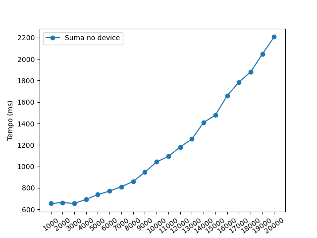

\newpage
\pagenumbering{arabic}

# Introdución

Nesta sección opcional da práctica usaremos a libraría [cuBLAS](https://docs.nvidia.com/cuda/cublas/index.html) para modificar o código realizado na anterior parte.

# Código

Para o noso caso, usaremos a función `cublasSgemm()` para realizar a multiplicación entre as matrices. Pódese ver a información dela [aquí](https://docs.nvidia.com/cuda/cublas/index.html?highlight=cublasSgemm#cublas-t-gemm).

É importante destacar que cuBLAS supón que as matrices se gardan por columnas, non por filas, polo que ó facer a multiplicación temos que indicar os factores ó revés, como se ve no seguinte código:

```c
cublasSgemm(handle, CUBLAS_OP_N, CUBLAS_OP_N, B_y, A_x, A_y,
            &alpha, d_B, B_y, d_A, A_y, &beta, d_C, B_y);
```

Pódese ver como indicamos primeiro B (`d_B`) e despois A (`d_A`), xa que se non tivésemos feito isto, a matriz devolta tería sido a transposta de C.

A esta función pasámoslle máis parámetros dos necesarios, xa que o que realiza é o seguinte cálculo:

$$\text{C} = \alpha (op(\text{A})op(\text{B})) + \beta \text{C}$$

Sendo $op()$ ben realizar a transposta, ben realizar a transposta conxugada ou ben non realizar ningunha operación sobre a matriz. Nós pasámoslle `CUBLAS_OP_N`, que xustamente significa o último.

Polo demais, o código mantense sen moitos cambios con respecto á version anterior, deixando de lado o feito que unha boa cantidade do realizado previamente xa non é necesario, como por exemplo indicar o número de *threads* por bloque que se utilizarán. Tamén se engade, xusto antes da chamada a `cublasSgemm()` outra chamada a `cublasCreate()`, pasándolle por referencia `handle`, que inicializa a libraría e reserva os recursos hardware necesarios tanto no *host* como no *device*.

# Resultados

## Consideracións iniciais

É preciso comentar que á hora de realizar a comprobación de resultados entre a matriz calculada polo *host* e aquela calculada por cuBLAS ás veces daba erro, de non ser correcta.

Miramos por que pasaba isto e descubrimos que, nalgúns cálculos, o resultados computado polo *host* difería ata 0.1 do calculado polo *device*, como se pode ver neste seguinte *output* da multiplicación de dúas matrices $10000\times10000$:

```
h_C2[5180766] = 2478.271729, h_C[5180766] = 2478.270508
h_C2[29393750] = 2532.188232, h_C[29393750] = 2532.189453
h_C2[36957501] = 2511.784180, h_C[36957501] = 2511.782959
h_C2[48420572] = 2498.240234, h_C[48420572] = 2498.241455
h_C2[48818060] = 2494.544922, h_C[48818060] = 2494.543701
```

Isto seguramente sexa un problema de precisión nas operacións de puntos flotantes, ó ser os resultados acadados bastante similares entre si e non completamente diferentes, polo que decidimos ignorar estas diferenzas para a obtención de datos de execución.

## Datos obtidos

Para a obtención dos resultados executáronse, por unha banda, as multiplicacións para as mesmas dimensións de matrices que na práctica anterior, para facer unha comparativa de tempo de execución entre estas dúas implementacións.

Despois, fixéronse probas con outras dimensións de matrices, máis sinxelas de representar nunha gráfica, e sen executar a parte no *host* porque a partir de certos valores ocupa moito tempo de cómputo.

| **Ax** | **Ay/Bx** | **By** | **Tempo *host* (ms)** | **Tempo *device* con CUDA (ms)** | **Tempo *device* (ms)** 
| :- | :- | :- |  :--: | :--: | :--:
1000 | 1000 | 1000 | 3427.962680 | 202.349844 | 654.804711
2000 | 3000 | 4000 | 85802.888052 | 320.766210 | 673.819730
4000 | 3000 | 4000 | 171087.506934 | 430.340655 | 710.247664
5000 | 5000 | 5000 | 494591.044646 | 643.848046 | 737.583535
10000 | 10000 | 10000 | 4368520.886362 | 4121.029101 | 1042.572156

Vemos nesta comparativa que, para tamaños pequenos de matrices, a implementación sen usar cuBLAS é máis rápida pero, canto máis crecen, menos diferenza hai entre os dous métodos ata que, como vemos para a multiplicación de matrices cadradas $1000 \times 1000$, a implementación de cuBLAS só tarda arredor dun 25% da orixinal.

Como xa comentamos, na táboa inferior aparecen os tempos para a multiplicación de matrices cadradas.

| **Dimensión** | **Tempo *device* (ms)** 
| :--  | :--:
1000 | 654.804711
2000 | 663.361515
3000 | 655.316097
4000 | 693.574489
5000 | 737.583535
6000 | 770.401459
7000 | 810.624650
8000 | 859.800075
9000 | 946.202668
10000 | 1042.572156
11000 | 1093.555950
12000 | 1180.640421
13000 | 1255.138030
14000 | 1409.672628
15000 | 1478.098637
16000 | 1657.943146
17000 | 1785.546241
18000 | 1880.163827
19000 | 2046.650499
20000 | 2206.970698

Vemos que o tempo crece moi lentamente, tanto comparándoo co tempo que teríamos acadado no *host* como coa implementación previa.

{ width=75% }

Podemos ver que o crecemento no tempo de execución é bastante estable e leve, chegando a un tempo na multiplicación das matrices $2000\times2000$ só un pouco superior á metade do tempo de multiplicación de matrices $1000\times10000$ coa implementación anterior.

# Conclusións

Pódense sacar en claro desta práctica dúas cousas importantes. A primeira é que, para según que tipos de cálculos, cuBLAS resulta nun código moito máis limpo e sinxelo de desenvolver, ó non ter o programador que implementar el a multiplicación de matrices. A segunda é que a libraría implementa solucións moi eficientes e rápidas.
