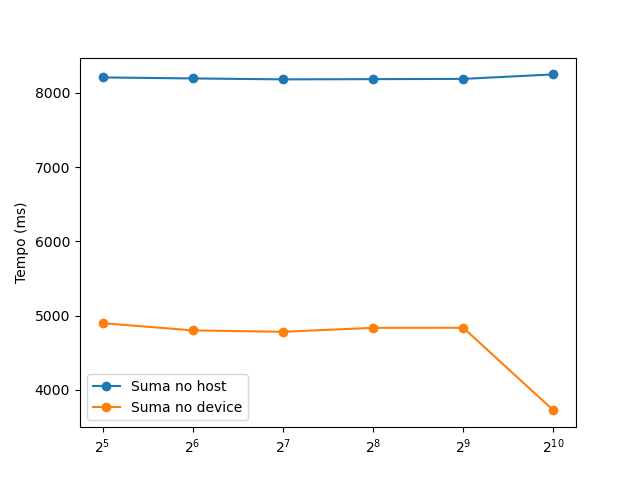
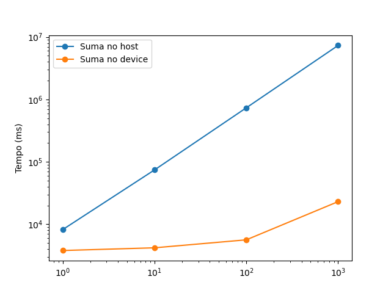
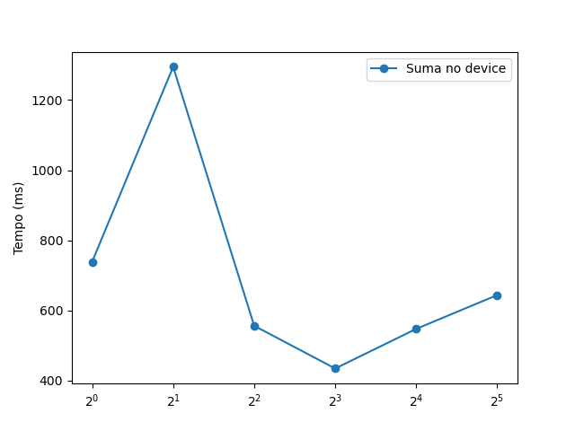

\newpage
\pagenumbering{arabic}

# Introdución

Nesta práctica realizaremos 4 experimentos distintos usando CUDA. O primeiro é unha simple obtención de información sobre as GPUs, o segundo é a medida de rendemento dun código simple e a terceira e a cuarta implican realizar o produto de dúas matrices cadradas, a última usando a libraría cuBLAS.

# Obtención de información sobre as GPUs

## Código

Este primeiro código é sinxelo, o único que fai é obter o número de tarxetas GPUs dispoñibles e, para cada unha delas, imprime certa información, gardada na variable `devProp`.

Cabe destacar que a forma de obter o número total de CUDA *cores* non é directamente a través dos datos gardados en `devProp`, senón que temos que usar os valores da *computer capability* para discernir a súa arquitectura e, así, sacar o total de *cores*.

O fallo desta implementación é que hai que ter en conta tódalas diferentes opcións no código, e a información do número de *cores* por multiprocesador hai que sacala de internet (por exemplo, [a documentación de Nvidia sobre CUDA](https://docs.nvidia.com/cuda/cuda-c-programming-guide/index.html#compute-capabilities)). Isto implica que habería que adaptar o código para cada nova xeración de GPUs só para poder imprimir esta información.

Senón, outra opción é, se está dispoñible, usar o comando `nvidia-settings -q CUDACores -t`, que devolve xa directamente o total de *cores*, a través dalgunha chamada ó sistema como `popen()`.

<!--
Cabe destacar que a forma de obter o número total de *CUDA cores* non é directamente a través dos datos gardados en `devProp`, senón que temos que usar os valores da *computer capability* para discernir a súa arquitectura e, con iso, buscar en internet as especificacións da tarxeta para atopar o número de *cores* por multiprocesador.

Outra opción é, se está dispoñible, usar o comando `nvidia-settings -q CUDACores -t`, que devolve xa directamente o total de *CUDA cores*.

https://docs.nvidia.com/cuda/cuda-c-programming-guide/index.html#compute-capabilities
-->

<!--
Cabe destacar que non conseguimos atopar a forma de obter o número total de *CUDA cores* a partir do número de multiprocesadores e do número de *cores* por multiprocesador na arquitectura invocando a algún dos parámetros da variable con tipo `cudaDeviceProp`, polo que o que fixemos foi, sabendo os números necesarios doutras chamadas, buscar na páxina web de Nvidia os datos necesarios.
-->

Polo demais, só é imprimir tal cal os datos gardados no `cudaDeviceProp` ou, como moito, facer un sinxelo cálculo:

```c
printf(" Computer Capability:       %d.%d\n", devProp.major, devProp.minor);
printf(" MultiProcessor Count:      %d\n",devProp.multiProcessorCount);
printf(" Max threads per MultiPr.:	%d\n",devProp.maxThreadsPerMultiProcessor);
printf(" Max Grid Size:		        %d\n",*devProp.maxGridSize);
printf(" Max Threads per Block:     %d\n",devProp.maxThreadsPerBlock);
printf(" Max Size for each Dim:     %d\n",*devProp.maxThreadsDim);
printf(" Num 32bits reg per SM:     %d\n",devProp.regsPerMultiprocessor);
printf(" Num 32bits reg per block	%d\n",devProp.regsPerBlock);
printf(" Shared Mem per MultiPr.:	%ld\n",devProp.sharedMemPerMultiprocessor/1024);
printf(" Shared Mem per Block:	    %ld\n",devProp.sharedMemPerBlock/1024);
printf(" Global Mem:	            %ld\n",devProp.totalGlobalMem/(1024*1024));
printf(" Peak Mem Clock Frec:	    %lf\n",devProp.memoryClockRate/1000.0);
printf(" Mem Bus With:	            %d\n",devProp.memoryBusWidth);
printf(" BWPeak:	                %lf\n",
       (devProp.memoryClockRate*1000*(devProp.memoryBusWidth/8.0)*2.0)/1000000000.0);
printf(" CUDA Cores:                ");
switch (devProp.major) {
    case 7:
        printf("%d\n", 64 * devProp.multiProcessorCount);
        break;
    case 8:
        if (devProp.minor == 0) printf("%d\n", 64 * devProp.multiProcessorCount);
        else printf("%d\n", 128 * devProp.multiProcessorCount);
        break;
    default:
        printf("NOT IMPLEMENTED\n");
}
```

No noso caso, ó traballar só cunha tarxeta T4 (*computer capability* 7.5), unha A100 (8.0) e unha RTX 3060 Mobile (8.6), non implementamos o resto de posibilidades.

Para executar o código, só temos que compilalo usando `nvcc` e movernos a un nodo GPU do CESGA no caso das T4 ou mandándoo a executar no caso da tarxeta A100. No caso de facelo fóra do CESGA, síguese o procedemento normal para a execución de calquera outro programa.

## Resultados

Como indicamos anteriormente, executouse en tres GPUs diferentes.

|                | **T4** | **A100** | **3060** |
| :-------       | :-: | :-:  | :-: |
| *Computer Capability* | 7.5 | 8.0  | 8.6 |
| Número de multiprocesadores | 40  | 108  | 30
| Máximo núm. de fíos por MP | 1024 | 2048 | 1536
| Tamaño máx. de cada dim. dun bloque | 2147483647 | 2147483647 | 2147483647
| Máx. núm. de fíos por bloque | 1024 | 1024 | 1024
| Tam. máx. de cada dim. dun bloque | 1024 | 1024 | 1024
| Núm. rexistros de 32b por MP | 65536 | 65536 | 65536
| Núm. rexistros de 32b por bloque | 65536 | 65536 | 65536
| Tam. memoria compartida por MP (KiB) | 64 | 164 | 100
| Tam. memoria compartida por bloque (KiB) | 48 | 48 | 48
| Tam. memoria global (GiB) | 14.6 | 39.4 | 5.8
| Frecuencia pico da memoria (MHz) | 5001 | 1215 | 7001
| Ancho de bus da memoria | 256 | 5120 | 192
| Ancho de banda pico | 320 | 1555 | 336

Se nos fixamos na descripción que dá Nvidia destas GPUs, vemos que a [T4](https://www.nvidia.com/en-us/data-center/tesla-t4/) está enfocada á IA, igual que a [A100](https://www.nvidia.com/en-us/data-center/a100/), mentres que a [RTX 3060](https://www.nvidia.com/es-es/geforce/laptops/30-series/#specs) está máis pensada para o *gaming* e o modelado.

Tamén sabemos, polo primeiro número da súa *computer capability* (ou *major*), que a T4 pertence á xeración Turin mentres que a A100 e a 3060 pertencen á xeración posterior, Ampere, polo que ten sentido que melloren as especificacións entre a T4 e a A100. O único dato onde a T4 é mellor que a A100 é na frecuncia pico da memoria, pero ó ter a A100 un ancho de bus moito maior, o ancho de banda é case 5 veces maior.

Se nos fixamos na 3060, observamos unha GPU moito máis modesta, con menor número de multiprocesadores, pero que ó pertencer a unha xeración superior e saír 3 anos despois, parece a simple vista que ten unhas especificacións á altura das da T4.

\newpage

# Medida de rendemento dun código CUDA simple

## Código

Neste caso, non temos que engadir ou modificar nada no código (sen contar as medicións de tempo), só temos que executalo. Aínda así, comentaremos un pouco o que este realiza.

Tras a inicialización de certos parámetros (o tamaño dos vectores, o número de fíos por bloque e o número de repeticións da suma, entre outros), reservamos memoria e populamos no *host* os vectores. Despois, o *host* realiza a operación el só, e obtemos o tempo de execución desta acción.

Unha vez feito este cálculo no *host*, resérvase o espazo dos vectores na memoria global do dispositivo (usando `cudaMalloc()` en vez de `malloc()`). Cópianse en memoria os valores previamente xerados para os dous sumandos e realízase a súa suma cunha chamada a `vectorAdd`, a quen se lle pasa usando a semántica de chamadas de *kernels* de CUDA información dos bloques por *grid* e dos fíos por bloque.

Posteriormente, comprobamos se houbo erros no lanzamento do *kernel* ou na execución da suma. Se non hai, copiamos o vector resultante ó *host*, xuntando as partes calculadas por cada fío e imprimimos o tempo que tardou en realizarse a suma.

Por último, comprobamos que a suma é correcta e liberamos tódala memoria usada.

## Resultados

Executaremos este código na A100 do CESGA, variando diferentes parámetros de cada vez.

### Diferentes tamaños de vector

O primeiro que faremos será medir os tempos para diferentes tamaños de vector, para un total de 256 *threads* por bloque e 1 repetición do lazo.

| **Tamaño** | **Tempo *host* (ms)** | **Tempo *device* (ms)** |
| :--- | :---: | :---: |
$10^3$ | 0.003857 | 331.251591
$10^4$ | 0.044808 | 258.329953
$10^5$ | 0.493129 | 302.056540
$10^6$ | 4.450172 | 468.629360
$10^7$ | 40.317998 | 450.536023
$10^8$ | 401.874508 | 476.674974
$10^9$ | 4065.065481 | 2821.461726
$10^{10}$ | 6220.958801 | 4091.282362
$10^{11}$* | 4943.596225 | 3163.310584
$10^{12}$** | ERRO | ERRO
4294967295*** | ERRO | ERRO

\footnotesize
\* O tamaño do vector foi de 1215752192 elementos

\*\* O tamaño do vector foi de 3567587328 elementos. A maiores, a suma non se realizou, xa que o tempo de execución do *host* foi moi pequeno e a execución no *device* devolveu un erro.

\*\*\* O valor máximo dun `unsigned int`.
\normalsize

Podemos ver na táboa os resultados para diferentes tamaños do vector. Cabe destacar que, para valores moi pequenos (menores de $10^8$), paralelizar a suma usando CUDA non paga a pena, xa que a reserva de memoria, a copia dos vectores e o lanzamento do *kernel* implican unha grande perda de tempo, aínda que é preciso dicir que o código só mide no *host* a suma en si mentres que no *device* mide tamén toda a inicialización previa xa comentada.

Outra cousa a destacar é que o programa garda o tamaño do vector nun `unsigned int`, polo que o valor máximo que pode acadar é 4294967295, por iso para $10^{11}$ e $10^{12}$ o tamaño final non é o pasado ó programa.

Tamén, no caso do máximo valor de `unsigned int`, houbo que modificar o *script* de Bash para a execución, xa que tardaba máis que o tempo máximo indicado orixinalmente.

Aínda así, a execución para este valor tampouco foi correcta. Isto é debido a que, se ben o valor do tamaño do vector é gardado como un `unsigned int`, pásase á función da suma de vectores (`h_vectorAdd()` para o *host* e `vectorAdd()` para o *device*, que podemos ver xusto debaixo) como un `int`, polo que o bit máis significativo pasa de indicar $2^x$ a indicar que o número é negativo.

```c
__host__ void
h_vectorAdd(const basetype *A, const basetype *B, basetype *C, int numElements) {
    for (int i = 0; i < numElements; ++i) {
        C[i] = A[i] + B[i];
    }
}

__global__ void
vectorAdd(const basetype *A, const basetype *B, basetype *C, int numElements) {
    int i = blockDim.x * blockIdx.x + threadIdx.x;

    if (i < numElements) {
        C[i] = A[i] + B[i];
    }
}
```

E, ó ser agora o número de elementos negativo, o *host* non vai entrar no *for* nin o *device* vai entrar no *if*.

Agora ben, se probamos con 2147483647, que é o máximo valor positivo que pode gardar un `int`, vemos que si que executa correctamente, obtendo os seguintes valores:

| **Tamaño** | **Tempo *host* (ms)** | **Tempo *device* (ms)** |
| :--- | :---: | :---: |
2147483647 | 8665.287236 | 3920.213778

E, se modificamos o código nesas poucas instancias onde hai un `int` no lugar dun `unsigned int`, atopamos os seguintes resultados (tamén se podería modificar aínda máis o código para gardar o tamaño do vector coma un `unsigned long` ou `unsigned long long`, pero decidimos modificar o código o mínimo e necesario, xa que neste caso estaba claro que era máis un erro que unha decisión consciente):

<!-- TODO: isto non vai -->
| **Tamaño** | **Tempo *host* (ms)** | **Tempo *device* (ms)** |
| :--- | :---: | :---: |
4294967295 | 17205.964521 | ERRO

Agora, se ben fai o cálculo de forma correcta no *host*, ó executalo de forma paralela volve dar un erro, neste caso ó realizar o `cudaMalloc()`. Non sabemos cal é o motivo, pero supoñemos que non é de memoria, xa que mandamos a executalo coa máxima cantidade que permite o CESGA (247GB), e un *array* de *float* con ese número de elementos ocuparía uns 16GB.

Polo tanto, consideramos para as seguintes seccións o tamaño máximo do vector como 2147483647.

### Diferentes valores de *threads* por bloque

Nesta seguinte sección, visualizaremos os cambios temporais que ocurren ó modificar o número de *threads* por bloque cun tamaño de vector de 2147483647. Ata agora, a cantidade de *threads* por bloque utilizada foi a por defecto, de 1024, que é o máximo que soporta a A100, como vimos na sección 2.2.

Escolleremos valores múltiplos de 32, que é o tamaño do *warp* da A100.

| **Núm. *threads*** | **Núm. bloques** | **Tempo *host* (ms)** | **Tempo *device* (ms)** |
| :--- | :--- | :---: | :---: |
32 | 67108864 | 8206.040677 | 4897.503498
64 | 33554432 | 8192.542434 | 4800.365083
128 | 16777216 | 8180.001850 | 4781.550056
256 | 8388608 | 8182.845302 | 4834.887684
512 | 4194304 | 8186.443082 | 4835.814052
1024 | 2097152 | 8246.838962 | 3723.304673

Podemos observar dúas cousas. A primeira, que o número de bloques aumenta conforme o número de *threads* diminúe e a segunda, que os mellores resultados acádanse con 1024 fíos, como se pode observar de mellor forma na gráfica inferior.

{ width=75% }

Consideramos que o mellor resultado é o de 1024 fíos, e é o que usaremos nos seguintes apartados, xa que ata chegar a el os tempos de execución mantense bastante constantes. Aínda así, o tempo de cómputo varía moito entre execucións. Se nos fixamos na táboa do apartado anterior para o tamaño de vector que usado aquí, vemos como hai case 200ms de diferencia entre un valor e outro.

### Diferente número de repeticións do lazo

Agora, modificaremos o número de repeticións da suma que realizamos, usando como número de *threads* por bloque o mellor valor acadado na sección anterior. Ata agora, só se executaba a suma unha vez e, igual que nos apartados previos, os valores escollidos serán logarítmicos.

| **Núm. repeticións** | **Tempo *host* (ms)** | **Tempo *device* (ms)** |
| :--- | :---: | :---: |
$1$ | 8207.947832 | 3797.599765
$10$ | 74208.212523 | 4196.888845
$10^2$ | 734703.949378 | 5632.132094
$10^3$ | 7340602.372579 | 23058.602886

{ width=75% }

Se nos fixamos nos valores conseguidos, podemos ver que o tempo de suma no *host* crece de forma logarítmica, mentres que na GPU este é máis estable.

O que podemos sacar desta gráfica é que, na medida do tempo no *device*, a parte que máis tempo consume é a reserva de memoria e a copia dos vectores dende o *host* e, se se medise o tempo só da suma en si, veriamos unha gráfica similar á da CPU pero con valores moito máis pequenos.

### Modificación do código para medir por separado tempos

Usando, igual que nas seccións anteriores, un vector de tamaño 2147483647 elementos, discretizaremos agora as medidas do tempo do *device* en 4 partes: o tempo de reserva da memoria na GPU, o tempo de envío dos vectores do *host* á GPU, o tempo de execución do *kernel* e o tempo de envío do *vector* resultado dende a GPU ó *host*.

Executamos a suma 10 veces, para 256 *fíos* e 1 repetición, sendo os resultados conseguidos os que se poden ver na táboa inferior.

----------------------------------  ------------
**Tempo *host* (ms)**                8194.535806
**T. reserva memoria (ms)**         316.676328
**T. envío vectores (ms)**          1574.292601
**T. execución (ms)**               18.793876
**T. envío vector resultado (ms)**  3515.518806
----------------------------------  -------------

Podemos observar como, de entre tódalas partes da execución na GPU, o máis custoso temporalmente é o envío dos vectores, tanto do *host* ó *device* como viceversa, sendo o tempo de execución da suma nin un 1% do total.

En canto á diferenza de tempo entre a copia dos vectores da CPU á GPU e a copia do vector resultado no outro sentido, supoñemos que é un erro, xa que nos dous sentidos a velocidade de copia debería ser similar. Nos foros de Nvidia ofrecen [esta resposta](https://forums.developer.nvidia.com/t/why-cudamemcpydevicetohost-is-too-slowly/195309), pero nós en principio temos ben situadas as chamadas, como se pode ver no código inferior:

```c
TSET( tstart );
checkError( cudaMalloc((void **) &d_A, size) );
checkError( cudaMalloc((void **) &d_B, size) );
checkError( cudaMalloc((void **) &d_C, size) );
TSET( tend );
tint = TINT(tstart, tend);
printf("DEVICE: Tempo para facer reserva de memoria de tamaño %u: %lf ms\n",
        numElements, tint);

TSET( tstart );
checkError( cudaMemcpy(d_A, h_A, size, cudaMemcpyHostToDevice) );
checkError( cudaMemcpy(d_B, h_B, size, cudaMemcpyHostToDevice) );
TSET( tend );
tint = TINT(tstart, tend);
printf("DEVICE: Tempo para facer copia de vectores de tamaño %u: %lf ms\n",
        numElements, tint);

TSET( tstart );
for(unsigned int r = 0; r < nreps; ++r) {
    vectorAdd<<<blocksPerGrid, threadsPerBlock>>>(d_A, d_B, d_C, numElements);
    checkError( cudaPeekAtLastError() );
    checkError( cudaDeviceSynchronize() );
}
TSET( tend );
tint = TINT(tstart, tend);
printf("DEVICE: Tempo para facer %u sumas de vectores de tamaño %u: %lf ms\n",
        nreps, numElements, tint);

TSET( tstart );
checkError( cudaMemcpy(h_C2, d_C, size, cudaMemcpyDeviceToHost) );
TSET( tend );
tint = TINT(tstart, tend);
printf("DEVICE: Tiempo para hacer copia de vector a host de tamaño %u: %lf ms\n",
        numElements, tint);
```

### Modificación do código para usar memoria unificada

Por último, modificouse o código para usar memoria unificada. Isto implica cambiar a forma en que reservamos a memoria para os vectores, resultando no código inferior (simplificado):

```c
checkError( cudaMallocManaged((void **) &A, size) );
checkError( cudaMallocManaged((void **) &B, size) );
checkError( cudaMallocManaged((void **) &C2, size) );
C = (basetype *) malloc(size);
```

Se desglosamos o tempo de execución, similar á sección anterior, observamos o seguinte:

-----------------------------------  ------------
**Tempo reserva memoria (ms)**         214.162569
**T. inicialización vectores (ms)**    90125.362661
**T. suma *host* (ms)**                8555.424670
**T. suma *device* (ms)**                2314.206932
----------------------------------  -------------

Se ben o tempo de reserva dos 3 vectores en memoria unificada é similar ó tempo acadado anteriormente, podemos ver un gran incremento no tempo da súa inicialización e da suma na GPU. Se vemos a documentación de CUDA, [esta](https://docs.nvidia.com/cuda/cuda-c-programming-guide/index.html#unified-memory-programming) di "[...]*a program’s run time typically does not decrease; Unified Memory instead enables the writing of simpler and more maintainable code*" e, se ben a segunda parte desta frase si que é certa no código (desaparecen as chamadas a `cudaMemcpy()` e `cudaMalloc()`, ó non seren necesarias), a primeira non semella cumplirse.

Esta diferenza no tempo total supoñemos que é debida a que a inicialización dos vectores usando memoria unificada non está ben optimizada, xa que o tempo de suma na GPU é similar ó tempo de envío dos vectores máis a súa execución visto no apartado previo e, como agora non temos que devolver o vector resultado, o que é a suma en si tarda menos que o conxunto medido anteriormente.

\newpage

# Produto de matrices simple en CUDA

Nesta última sección, completaremos un código que realiza a multiplicación de dúas matrices cadradas, despois adaptarémolo a matrices rectangulares e, por último, estudaremos o seu rendemento na A100.

## Código para matrices cadradas

Neste caso, só tivemos que encher as liñas marcadas cun *TODO* da forma que vemos a continuación:

```c
// TODO: Calcula el indice de la fila de C y A
int i = blockDim.x * blockIdx.x + threadIdx.x;
// TODO Calcula el indice de la columna de C y B
int j = blockDim.y * blockIdx.y + threadIdx.y;


// TODO: Calcula el número de bloques en el Grid (bidimensional)
dim3 blocksPerGrid(matrizDim / threadsPerBlock.x, matrizDim / threadsPerBlock.y, 1);

// TODO: Lanza el kernel CUDA
matrizMul<<<blocksPerGrid, threadsPerBlock>>>(d_A, d_B, d_C, matrizDim);
```

Se executamos o código, vemos que devolve que o resultado do producto no *host* e na GPU é idéntico, polo que está ben implementado.

Aínda así, non faremos agora as medicións de rendemento, senón que agardaremos a ter implementado o código para as matrices rectangulares.

## Código para matrices rectangulares

Neste caso, modificamos máis partes do código que as 4 liñas da sección anterior, polo que adxuntamos o programa resultante xunto con este documento PDF.

Cabe destacar que no código úsase unha variable para o número de columnas de A e outra para o número de filas de B. Isto non é necesario, xa que os seus valores teñen que ser idénticos, pero está posto así por claridade.


## Estudo do rendemento

Para o estudo do rendemento, probamos con diversos tamaños de matrices e cantidade de fíos por bloque. Ademais, buscamos que o número de bloques residentes se adecúe ó máximo permitido. Segundo a sección 1.4.1 da [documentación das Nvidia Ampere](https://docs.nvidia.com/cuda/ampere-tuning-guide/index.html) o número máximo de bloques por SM é de 32 e, tendo a A100 108 SMs, significa que o máximo total é de 3456 bloques.

O problema é que, tal e como calculamos o número de bloques en relación ó tamaño das matrices e o número de fíos especificado (visible no código inferior), pouco teñen que crecer as dimensións das matrices para superar o máximo de bloques residentes, xa que non podemos aumentar o número de fíos para contrarrestalo, ó ser o número máximo de fíos por bloque de 1024 ($32 \times 32$).

```c
dim3 threadsPerBlock( tpbdimx, tpbdimy, 1 );
dim3 blocksPerGrid( (A_x+tpbdimx) / threadsPerBlock.x,
            (B_y+tpbdimy) / threadsPerBlock.y, 1 );
```

Cabe destacar que a forma na que creamos o número de bloques resulta en máis dos estrictamente necesarios.

| **Ax** | **Ay/Bx** | **By** | **Bloques** | ***threads*** | **Tempo *host* (ms)** | **Tempo *device* (ms)** |
| :-- | :-- | :-- | :-- | :-- | :--: | :--: |
$10^3$ | $10^3$ | $10^3$ | (32,32) | (32,32) | 3373.827123 | 202.349844
$2000$ | $3000$ | $4000$ | (63,126) | (32,32) | 85844.428895 | 320.766210
$4000$ | $3000$ | $4000$ | (126,126) | (32,32) | 171870.613203 | 430.340655
$5000$ | $5000$ | $1000$ | (157, 32) | (32,32) | 82752.655373 | 311.732771
$5000$ | $5000$ | $1000$ | (313,63) | (16,16) | 83063.790491 | 274.403004
$5000$ | $5000$ | $5000$ | (157,157) | (32,32) | 496509.663427 | 643.848046
$5000$ | $5000$ | $5000$ | (313,313) | (16,16) | 499212.680472 | 547.448208
$5000$ | $5000$ | $5000$ | (626,626) | (8,8) | 498039.980314 | 434.454810
$5000$ | $5000$ | $5000$ | (1251,1251) | (4,4) | 493697.268409 | 556.327524
$5000$ | $5000$ | $5000$ | (2501,2501) | (2,2) | 491184.255205 | 1294.805963
$5000$ | $5000$ | $5000$ | (5001,5001) | (1,1) | 491294.250847 | 738.772121
$10^4$ | $10^4$ | $10^4$ | (313,313) | (32,32) | 4366676.319740 | 4121.029101

Podemos observar, nestes resultados, que a multiplicación de matrices na GPU é varios ordes de magnitude máis rápida que na CPU.

Tamén é posible ver, tanto para a multiplicación dunha matriz $5000 \times 5000$ por outra de $5000 \times 1000$ como para a multiplicación de dúas matrices $5000\times5000$, que o tempo de execución diminúe con menos fíos por bloque que o máximo, pero ata certo punto, xa que se pode ver (de forma máis cómoda na gráfica inferior) que o tempo empeza a subir de novo cando hai moi poucos *threads* nun bloque.

{ width=75% }
